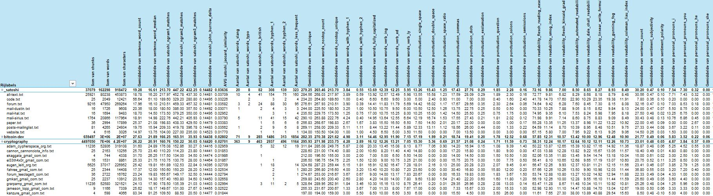
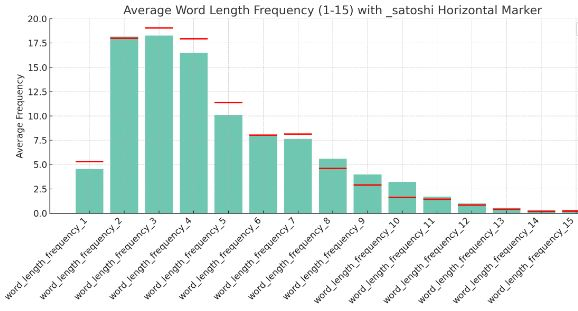
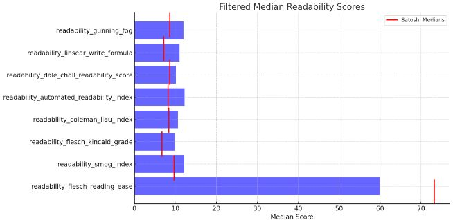
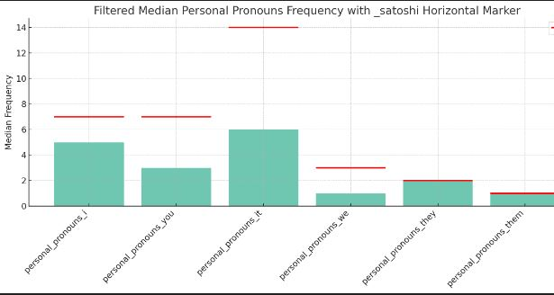

# Where is Satoshi?
_TL;DR: you could most probably find the real Satoshi Nakamoto here._

This repository contains:
- 👉 500,000+ mailing list posts (10+ lists, 75,000+ authors, 1992-2000) 
- 😵 7,500,000+ Reddit comments (/u/Bitcoin, 70,000+ authors, 2005-2019) 
- 📖 All texts (posts, mails, code comments, paper) written by Satoshi 
- 📈 Stylometric analysis of words, punctuation, slang, sentences, n-grams, word lengths, & spelling checks 
- 📚 John Burrow's Delta, Jaccard Similarity, Flesch, Gunning Fog, Dale-Chal, Coleman, SMOG  
- 📊 Comparison of Satoshi's text with all other chunks of data 

**Download: [XLS pivot](/output/comparison.xlsx) (480MB) | [CSV raw](/output/comparison.csv) (240MB)**

## Satoshi facts & figures
Sources: Bitcoin paper, mail communication, mailing list posts (excluding the 2 posts in 2015), forum posts, code comments, website texts 
- **Words**: [81,500](/data/_satoshi/all-text.txt) words, [6,000](/output/n-gram/1.txt) unique words, [4,750](/output/sentences.txt) unique sentences
- **Characters**: 460,000 w/ spaces, 385,000 w/o spaces
- **British English**: realise, cheque, customisations, favour, adminning, funnelling, decentralised, colour, labelled, formalised, reorganised, sceptical, fulfil, honour, neighbour, labour, dependants, analysed, labelling, liberalising, optimised, optimisation, colours, greyed, modernised, synchronising , defence, amortised, ...[GB-US spellcheck](/output/spellcheck) 
- **Hyphenated words**: re-broadcasting, multiple-invocation, un-upgraded, double-spends, pre-compiled, sub-languages, anti-embedding, non-routable, time-sharing, reverse-spamming, self-defeating, market-determined, re-requested,  non-reversible, de-emphasize, pre-announce, ...[and more](/output/hyphen/1.txt)
- **2+ hyphens**: no-priority-requirement, man-in-the-middle(d), one-person-one-vote, one-CPU-one-vote, zero-knowledge-proofs, created-but-never-used, tit-for-tat, back-of-the-envelope, stable-with-respect-to-energy, non-lower-ASCII, delete-at-will, delete-and-lose-everything-in-your-other-files, almost-release-candidate, one-time-use, free-for-all, inventory-request-data,...[and more](/output/hyphen/2.txt)
- **Dot decimal separator**: National standard in US, UK, Japan, China, Switzerland, Australia, ..
- **Slang**: yuck, darn, nope, heck, pay-naggy, laggy, gotta, dumbed down
- **Few typo's**: incomming, resurect, transfered, walkthough
- **Double-spacing**: 2,000+ times double-spacing after a sentence, 150 single. Consistent in all communication from day 1 (... my personal favorite) 
- **Capitalized abbreviations**: CPU/cpu (63/2), P2P/p2p (19/3), JSON/json (55,18), SVN/svn (65/0), HTTP/http (19/5)
- **Punctuation**: !(29) ?(145) ,(2,800) .(2,400) :(96) ;(22)
- **Pronouns**: I(950), you(1040), your(270), we(370), us(20) me(50)
- **Verb suffixes**: 6,000 unique words. -ing(490) -ed(540), -ly(220) ...[view all words](/output/verb-suffix)
- **-> indicator**: consistently without spaces: "Options->Change", "Options->Generate Coins", ..

### Satoshi in numbers
| source:                                      | all-text.txt | code.txt | forum.txt | mail-dustin.txt | mail-hal.txt | mail-sirius.txt | paper.txt | posts-mailinglist.txt | website.txt |
|:---------------------------------------------|:-------------|:---------|:----------|:----------------|:-------------|:----------------|:----------|:----------------------|:------------|
| SUM words                                    | 80238        | 2049     | 47950     | 1726            | 1694         | 20866           | 2994      | 4265                  | 516         |
| SUM characters                               | 453873       | 12421    | 269264    | 9608            | 9483         | 117964          | 17899     | 24934                 | 3026        |
| AVG sentence_word_count                      | 18.78        | 56.64    | 17.96     | 20.36           | 18.7         | 18.91           | 25.37     | 19.75                 | 14.97       |
| AVG sentence_word_median                     | 16.2         | 51.1     | 16.1      | 18.0            | 14.5         | 14.98           | 21.08     | 15.94                 | 13.75       |
| AVG satoshi_ngram1_matches                   | 217.97       | 189.6    | 210.51    | 180.5           | 173.5        | 222.76          | 198.83    | 209.33                | 104.0       |
| AVG satoshi_ngram2_matches                   | 452.78       | 329.2    | 459.33    | 386.0           | 379.25       | 442.21          | 438.33    | 419.78                | 227.0       |
| AVG satoshi_ngram3_matches                   | 437.3        | 280.8    | 457.32    | 357.5           | 350.0        | 405.93          | 429.5     | 396.78                | 235.0       |
| AVG satoshi_john_burrow_delta                | 0.14481      | 0.14495  | 0.14481   | 0.14492         | 0.14495      | 0.14481         | 0.14479   | 0.14483               | 0.14523     |
| AVG satoshi_jaccard_similarity               | 0.03709      | 0.03226  | 0.03582   | 0.03071         | 0.02952      | 0.0379          | 0.03383   | 0.03562               | 0.0177      |
| SUM satoshi_words_slang                      | 10.0         | -      | 3.0       | 1.0             | -          | 5.0             | -       | 1.0                   | -         |
| SUM satoshi_words_typo                       | 4.0          | 2.0      | 2.0       | -             | -          | -             | -       | -                   | -         |
| SUM satoshi_words_british                    | 41.0         | -      | 24.0      | 2.0             | -          | 11.0            | 1.0       | 2.0                   | 1.0         |
| SUM satoshi_words_hyphen_1                   | 154          | 3        | 88        | 4               | 3            | 41              | 5         | 9                     | 1           |
| SUM satoshi_words_hyphen_2                   | 75           | 2        | 30        | 3               | 1            | 15              | 6         | 6                     | 1           |
| SUM satoshi_words_less_frequent              | 160          | 4        | 95        | 3               | 4            | 42              | 6         | 8                     | 1           |
| AVG words_unique                             | 284.56       | 234.2    | 276.61    | 244.0           | 235.5        | 290.1           | 256.83    | 269.11                | 134.0       |
| AVG words_nostop_count                       | 268.03       | 264.8    | 267.93    | 225.5           | 229.75       | 263.88          | 268.67    | 258.0                 | 150.5       |
| AVG words_nostop_unique                      | 217.97       | 189.6    | 210.51    | 180.5           | 173.5        | 222.76          | 198.83    | 209.33                | 104.0       |
| AVG words_with_hyphen_1                      | 3.89         | 1.0      | 3.9       | 3.25            | 1.25         | 4.24            | 2.67      | 5.11                  | 1.0         |
| AVG words_with_hyphen_2                      | 0.59         | 0.4      | 0.39      | 1.0             | 0.75         | 0.4             | 1.67      | 1.11                  | 1.0         |
| AVG words_fully_capitalized                  | 13.92        | 6.6      | 14.41     | 10.5            | 17.0         | 14.95           | 3.83      | 8.44                  | 4.5         |
| AVG words_verb_ing                           | 12.57        | 6.6      | 11.83     | 10.75           | 10.75        | 13.64           | 15.5      | 13.22                 | 6.5         |
| AVG words_verb_ed                            | 12.49        | 9.6      | 11.79     | 9.5             | 15.25        | 12.55           | 16.5      | 11.44                 | 5.0         |
| AVG words_verb_ly                            | 5.98         | 3.0      | 5.69      | 6.0             | 8.0          | 6.64            | 6.5       | 5.89                  | 3.5         |
| AVG punctuation_single_space                 | 13.55        | 5.0      | 14.42     | 10.5            | 10.25        | 12.19           | 7.5       | 12.33                 | 11.5        |
| AVG punctuation_double_space                 | 15.58        | 2.4      | 16.02     | 12.5            | 15.0         | 16.74           | 14.5      | 13.11                 | 0.0         |
| AVG punctuation_space_ratio                  | 1.23         | 0.93     | 1.17      | 1.26            | 1.42         | 1.53            | 2.01      | 1.12                  | 0.0         |
| AVG punctuation_commas                       | 17.59        | 11.0     | 17.67     | 13.75           | 14.5         | 17.55           | 20.17     | 18.56                 | 7.0         |
| AVG punctuation_dots                         | 28.09        | 7.0      | 29.56     | 22.75           | 25.5         | 27.43           | 22.0      | 26.0                  | 13.5        |
| AVG punctuation_exclamation                  | 0.29         | 0.0      | 0.35      | 0.25            | 0.25         | 0.21            | 0.0       | 0.44                  | 0.0         |
| AVG punctuation_question                     | 1.89         | 0.4      | 2.3       | 0.5             | 0.75         | 1.81            | 0.0       | 0.0                   | 0.0         |
| AVG punctuation_colons                       | 2.3          | 1.6      | 2.64      | 0.5             | 1.75         | 2.02            | 1.0       | 1.33                  | 3.0         |
| AVG punctuation_semicolons                   | 0.16         | 2.4      | 0.06      | 0.0             | 0.0          | 0.12            | 0.17      | 0.22                  | 0.0         |
| AVG readability_flesch_reading_ease          | 72.77        | 41.78    | 74.64     | 70.33           | 74.95        | 71.98           | 55.28     | 64.59                 | 67.15       |
| AVG readability_smog_index                   | 9.81         | 14.7     | 9.42      | 10.25           | 9.35         | 9.91            | 13.35     | 11.14                 | 5.8         |
| AVG readability_flesch_kincaid_grade         | 6.82         | 17.6     | 6.28      | 7.88            | 6.1          | 7.14            | 11.25     | 8.7                   | 7.0         |
| AVG readability_automated_readability_index  | 8.29         | 22.9     | 7.6       | 9.05            | 7.53         | 8.6             | 13.37     | 10.39                 | 7.95        |
| AVG readability_dale_chall_readability_score | 8.68         | 10.29    | 8.45      | 8.15            | 8.24         | 8.75            | 8.98      | 8.95                  | 9.22        |
| AVG readability_linsear_write_formula        | 8.18         | 23.35    | 7.3       | 8.62            | 5.98         | 8.83            | 11.22     | 8.48                  | 6.13        |
| AVG readability_gunning_fog                  | 8.79         | 19.38    | 8.15      | 9.84            | 7.95         | 9.09            | 13.22     | 10.51                 | 9.26        |
| AVG readability_coleman_liau_index           | 8.48         | 11.91    | 8.08      | 8.13            | 8.18         | 8.49            | 10.92     | 9.75                  | 9.06        |
| AVG sentence_count                           | 30.56        | 7.8      | 32.16     | 24.0            | 27.5         | 30.43           | 22.0      | 27.33                 | 14.5        |
| AVG sentiment_subjectivity                   | 0.47         | 0.36     | 0.47      | 0.47            | 0.48         | 0.48            | 0.45      | 0.44                  | 0.26        |
| AVG sentiment_polarity                       | 0.1          | 0.1      | 0.1       | 0.07            | 0.02         | 0.13            | 0.09      | 0.08                  | 0.03        |
| AVG personal_pronouns_i                      | 7.71         | 0.2      | 7.03      | 5.5             | 13.25        | 10.76           | 0.0       | 3.67                  | 1.5         |
| AVG personal_pronouns_you                    | 7.43         | 0.0      | 8.53      | 8.75            | 6.75         | 6.86            | 0.0       | 3.22                  | 3.0         |
| AVG personal_pronouns_he                     | 0.32         | 0.0      | 0.18      | 0.0             | 0.0          | 0.45            | 2.67      | 0.11                  | 0.0         |
| AVG personal_pronouns_she                    | 0.0          | 0.0      | 0.0       | 0.0             | 0.0          | 0.0             | 0.0       | 0.0                   | 0.0         |
| AVG personal_pronouns_it                     | 15.09        | 6.6      | 16.14     | 15.0            | 13.75        | 14.81           | 7.0       | 12.11                 | 5.5         |
| AVG personal_pronouns_we                     | 2.75         | 2.6      | 2.75      | 1.0             | 0.0          | 3.21            | 3.33      | 1.11                  | 0.0         |
| AVG personal_pronouns_they                   | 2.05         | 1.0      | 1.76      | 2.75            | 0.75         | 2.5             | 2.17      | 3.56                  | 2.5         |
| AVG personal_pronouns_me                     | 0.43         | 0.2      | 0.34      | 0.75            | 0.75         | 0.64            | 0.0       | 0.11                  | 0.0         |
| AVG personal_pronouns_him                    | 0.1          | 0.0      | 0.06      | 0.0             | 0.0          | 0.17            | 0.5       | 0.0                   | 0.0         |
| AVG personal_pronouns_her                    | 0.0          | 0.0      | 0.0       | 0.0             | 0.0          | 0.0             | 0.0       | 0.0                   | 0.0         |
| AVG personal_pronouns_us                     | 0.02         | 0.0      | 0.04      | 0.0             | 0.0          | 0.0             | 0.0       | 0.0                   | 0.0         |
| AVG personal_pronouns_myself                 | 0.02         | 0.0      | 0.01      | 0.0             | 0.0          | 0.07            | 0.0       | 0.0                   | 0.0         |
| AVG personal_pronouns_them                   | 0.93         | 0.2      | 0.9       | 1.0             | 1.25         | 1.12            | 1.33      | 0.67                  | 0.0         |
| AVG personal_pronouns_yourself               | 0.07         | 0.0      | 0.09      | 0.0             | 0.0          | 0.07            | 0.0       | 0.0                   | 0.0         |
| AVG word_length_frequency_1                  | 5.32         | 3.36     | 5.66      | 4.6             | 6.09         | 4.78            | 4.34      | 4.56                  | 3.41        |
| AVG word_length_frequency_2                  | 18.01        | 16.57    | 18.08     | 18.18           | 16.4         | 18.13           | 18.57     | 17.62                 | 17.54       |
| AVG word_length_frequency_3                  | 19.08        | 16.33    | 19.27     | 18.3            | 20.22        | 19.26           | 17.5      | 18.84                 | 17.65       |
| AVG word_length_frequency_4                  | 17.96        | 18.57    | 18.06     | 20.14           | 18.48        | 18.25           | 14.3      | 16.31                 | 16.64       |
| AVG word_length_frequency_5                  | 11.37        | 13.53    | 11.41     | 10.75           | 12.05        | 10.99           | 11.9      | 11.12                 | 14.74       |
| AVG word_length_frequency_6                  | 7.99         | 9.68     | 7.82      | 8.18            | 7.75         | 8.31            | 7.58      | 8.26                  | 11.63       |
| AVG word_length_frequency_7                  | 8.13         | 8.96     | 8.0       | 9.92            | 7.45         | 8.23            | 8.32      | 9.1                   | 4.61        |
| AVG word_length_frequency_8                  | 4.6          | 3.92     | 4.6       | 3.22            | 4.89         | 4.55            | 6.21      | 4.46                  | 2.21        |
| AVG word_length_frequency_9                  | 2.91         | 2.88     | 2.85      | 3.18            | 3.1          | 2.88            | 3.31      | 2.97                  | 4.45        |
| AVG word_length_frequency_10                 | 1.59         | 1.16     | 1.46      | 1.17            | 1.08         | 1.75            | 2.17      | 2.53                  | 3.94        |
| AVG word_length_frequency_11                 | 1.42         | 2.84     | 1.3       | 0.9             | 0.6          | 1.41            | 2.67      | 1.98                  | 1.31        |
| AVG word_length_frequency_12                 | 0.84         | 1.2      | 0.77      | 0.55            | 1.06         | 0.76            | 1.77      | 0.95                  | 0.8         |
| AVG word_length_frequency_13                 | 0.41         | 0.48     | 0.37      | 0.61            | 0.51         | 0.35            | 0.93      | 0.71                  | 0.8         |
| AVG word_length_frequency_14                 | 0.17         | 0.2      | 0.18      | 0.15            | 0.1          | 0.15            | 0.17      | 0.31                  | 0.1         |
| AVG word_length_frequency_15                 | 0.2          | 0.32     | 0.18      | 0.16            | 0.25         | 0.21            | 0.27      | 0.29                  | 0.2         |

### Comparison in graphs
Texts of Satoshi compared to all(!) authors

 
<small>Graph on how word length are divided over all texts. Outliers: 4, 5, 10</small>

 
<small>Scores indicates that Satoshi's text are easy to understand/read (lower = easier, except for Flesch where higher = easier).</small>

 

### Tips & Tricks:
- **N-gram analysis**: Satoshi's most used n-grams were not very common before 2010 (Bitcoin, transaction, time stamping server, blockchain, etc). After 2010 they were used a lot, which makes n-gram/text comparison harder for people that were only active in the pre-Bitcoin phase. Compare fair!
- **Last chunk**: Filter out the last chunk if you are going to aggregate totals. Last chunk is almost never 500 tokens and could heavily impact your results, especially when authors have a few chunks.
- **Outliers**: use median/stddev instead of mean/average when aggregating. Technical posts often contains code snippets, which impacts deviation/peaks in numbers.
- **Mean/averages**: ... For lower numbers without much variation use means
- **ML prediction**: Exclude the (real) Satoshi posts from your training set?!

## Dataset
- **Public archives**: All data is publicly available and downloaded via public archives. Only the  https://marc.info/ archive was scraped (...with respectful delays, sorry Hank!)
- **Uniqueness** some authors were active under multiple names and or mail addresses and/or used remailer services (to post anonymously)
- **Reply extraction**: good extraction in mail threads is hard! No guarantee that texts fully belongs to the author (different ways of quotation, indentation, reply)
- **Duplicate lines**: some sources contain cross-posts across multiple lists & duplicate signatures. Duplicate lines are removed before text chunking.
- **Chunks**: Data was chunked per 500 tokens (not taken the current sentence into account). Token regex: `\b[a-zA-Z0-9-']+\b`
- **Minimum chunks**: Files with less than 500 tokens was not analyzed.

### Reddit
All Reddit comments are publicly available via [Google BigQuery](https://console.cloud.google.com/bigquery?ws=!1m4!1m3!3m2!1sfh-bigquery!2sreddit_comments) (2009-2019)

### Mailing list
Extracted texts from mailing lists where Satoshi was and/or could be active.
- bitcoin-dev (2011-2020)
- cryptography (2001-2020)
- cypherpunks-cpunks1 (1992-2013)
- cypherpunks-cpunks2 (2013-2020)
- cypherpunks-venona (1992-1998)
- cypherpunks-marc (1992-2020) (includes replies to non-cypherpunks lists)
- gnupg-users (1999-2020)
- p2p-research (2007-2011)
- tor-talk (2004-2020)
- testlist-cpunks (1992-2019)
- winpt-users (2005-2009)

Missing archives: [[cypherpunks-moderated]](https://www.mail-archive.com/cypherpunks-moderated@minder.net/), [[openssl-users] (<2014)](https://mta.openssl.org/mailman/listinfo/openssl-users), [[cryptopp-users]](https://groups.google.com/g/cryptopp-users), [[tor-talks]](https://archives.seul.org/tor/talk/), [e-gold-list], [[p2p-hackers]](https://www.mail-archive.com/p2p-hackers@lists.zooko.com/)  [[gsc] (gold-silver-crypto)](https://gold-silver-crypto.rayservers.narkive.com/p/56#)

### Field description
|Field| Description                                                                                                                                      |
|:----|:-------------------------------------------------------------------------------------------------------------------------------------------------|
|source| The origin of the text, such as a mailing list or Reddit.                                                                                        |
|filename| Identifier for the author, such as a username or email address.                                                                                  |
|chunks| The total number of text chunks analyzed for this author.                                                                                        |
|chunk| The specific chunk of text being analyzed.                                                                                                       |
|words| The total number of words or tokens analyzed in the chunk.                                                                                       |
|characters| The total number of characters in the chunk.                                                                                                     |
|satoshi_ngram1_matches| Count of single-word matches with known Satoshi writings.                                                                                        |
|satoshi_ngram2_matches| Count of two-word sequences (bigrams) matches with known Satoshi writings.                                                                       |
|satoshi_ngram3_matches| Count of three-word sequences (trigrams) matches with known Satoshi writings.                                                                    |
|satoshi_john_burrow_delta| A stylometric measure comparing the text to Satoshi's known writings using John Burrows' Delta method. Lower = higher match                      |
|satoshi_jaccard_similarity| The Jaccard similarity index comparing the text to Satoshi's known writings. Higher = higher match                                               |
|satoshi_words_british| British English words matching with Satoshi writing                                                                                              |
|satoshi_words_slang| Slang words that Satoshi has used.                                                                                                               |
|satoshi_words_typo| Typos found in Satoshi's known writings.                                                                                                         |
|satoshi_words_hyphen_1| Single hyphenated words matching Satoshi's writing style.                                                                                        |
|satoshi_words_hyphen_2| Double(+) hyphenated words matching Satoshi's writing style.                                                                                     |
|satoshi_words_less_frequent| Less frequently used words in Satoshi's writings. Less than 100 times in total for all authors                                                   |
|words_unique| The number of unique words in the chunk.                                                                                                         |
|words_nostop_count| The number of words in the chunk, excluding common stopwords.                                                                                    |
|words_nostop_unique| The number of unique words in the chunk, excluding common stopwords.                                                                             |
|words_with_hyphen_1| Count of single hyphenated words found in the chunk.                                                                                             |
|words_with_hyphen_2| Count of 2-hyphen-plus words found in the chunk.                                                                                                 |
|words_fully_capitalized| Count of words that are fully capitalized.                                                                                                       |
|punctuation_single_space| Count of occurrences of a single space after punctuation.                                                                                        |
|punctuation_double_space| Count of occurrences of a double space after punctuation.                                                                                        |
|punctuation_space_ratio| Ratio double spacing - single spacing                                                                                                            |
|punctuation_commas| Count of commas in the chunk.                                                                                                                    |
|punctuation_dots| Count of dots in the chunk.                                                                                                                      |
|punctuation_exclamation| Count of exclamation marks in the chunk.                                                                                                         |
|punctuation_question| Count of question marks in the chunk.                                                                                                            |
|punctuation_colons| Count of colons in the chunk.                                                                                                                    |
|punctuation_semicolons| Count of semicolons in the chunk.                                                                                                                |
|readability_flesch_reading_ease| A readability score based on the Flesch reading-ease test.                                                                                       |
|readability_smog_index| A readability score based on the SMOG index, indicating years of education needed to understand the text.                                        |
|readability_flesch_kincaid_grade| A readability grade level based on the Flesch-Kincaid grade level test.                                                                          |
|readability_coleman_liau_index| A readability score based on the Coleman-Liau index, indicating the US grade level needed to understand the text.                                |
|readability_automated_readability_index| A readability score indicating the US grade level needed to understand the text based on characters per word and words per sentence.             |
|readability_dale_chall_readability_score| A readability score based on the Dale-Chall formula, indicating the US grade level needed to understand the text using a list of familiar words. |
|readability_linsear_write_formula| A readability score based on the Linsear Write formula, calculating text difficulty based on sentence length and easy/hard word count.           |
|readability_gunning_fog| A readability score based on the Gunning fog index, indicating years of education needed to understand the text.                                 |
|sentence_count| The number of sentences in the chunk.                                                                                                            |
|sentence_word_count| The total number of words in all sentences.                                                                                                      |
|sentence_word_median| The median word count per sentence.                                                                                                              |
|sentiment_subjectivity| A measure of subjectivity in the text, with higher values indicating more subjective text.                                                       |
|sentiment_polarity| A measure of the overall sentiment in the text, ranging from negative to positive.                                                               |

 
  

### Background
Weeks before the Bitcoin launch, Satoshi Nakamoto was in contact with famous cypherpunks and people on the cryptography mailing list. Most probably he lurked and/or was an active user on these cryptography/cypherpunks lists. Also, Reddit (/r/Bitcoin) had a lot of in-depth Bitcoin discussions between cypherpunks in the early days.

Assume Satoshi was already active on the internet (...under his real name), you could find the needle in the haystack in these data sources.

### All fine, who is the real Satoshi !?!!!1!
Yes, i have a short-list of suspects. No, i’m not going to drop names here because i’m not 100% sure. Proven statistical text based / author comparison techniques are used, but this isn’t enough to automatically conclude the real Satoshi; High correlation only shows a similar use of language pattern --> high correlation does not imply causation

Please do your own research, interpret everything with care and don't trust the outliers. Cheers!

### Disclaimer
The plan was to have some Python refreshment since that was already a while ago. Well, that escalated a bit: Python -> Large datasets -> Reddit comments on BigQuery -> Satoshi's texts -> Stylometric analysis -> text comparison...

_"The chase is better than the catch"_ - There is no personal interest in Satoshi's real identity. i sold my stake in 2012, way before the hype started. Unfortunately!
